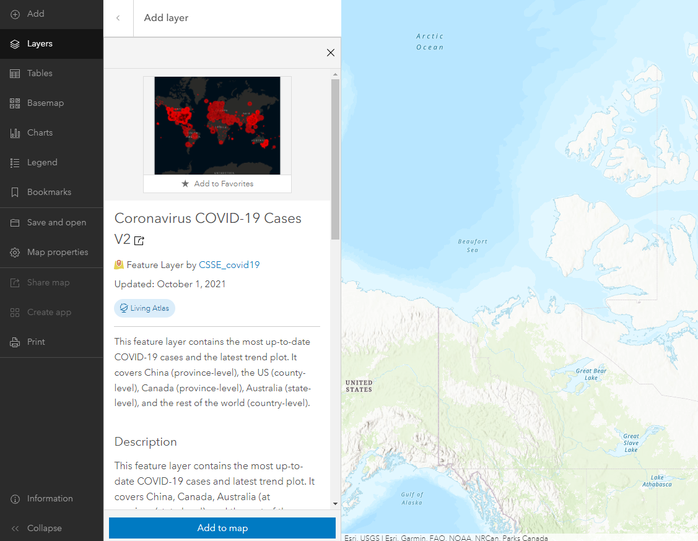

## ADD DATA FROM LIVING ATLAS

To Do
{: .label .label-green }
*1*{: .circle .circle-blue} On the sidebar on the left, click on **Layers**, then on **Add layer** in the **Layers** pane that opens.

*2*{: .circle .circle-blue} From the dropdown arrow next to **My Content**, select **Living Atlas**.

The [Living Atlas](https://livingatlas.arcgis.com/en/) is a large collection of geographic information compiled and created by [Esri.](https://www.esri.com/en-us/home)

*3*{: .circle .circle-blue} Where it says **Search for layers**, type “COVID-19 Canada” and hit enter to see what layers may be available. Click on “Coronavirus COVID-19 Cases V2.” An information dialogue will open with information about this layer.   

*Note: If you only have a public ArcGIS account, you will have access to fewer layers in the Living Atlas.*

*4*{: .circle .circle-blue} Scroll down to read about it. This layer is created and maintained by the Center for Systems Science and Engineering (CSSE) at the Johns Hopkins University, which is also maintaining the well known [Dashboard](https://coronavirus.jhu.edu/map.html) tracking COVID-19 cases and deaths across the world. This layer contains the same underlying data feeding that dashboard.

*5*{: .circle .circle-blue} Click the blue **Add to Map** button, then click the back arrow next to **Add layer** search bar to see the list of layers. ArcGIS Online will choose a symbology for you, and the legend using this symbology will appear in the **Symbology** pane to the right of the map.

*6*{: .circle .circle-blue} If your extent is still showing the University of British Columbia campus, zoom out using the scroll on your mouse or by clicking the minus button in the lower right until you see the single red circle representing British Columbia. If you'd like, you can zoom out to show the extent of the data for the entire world.

### *Reflection Question*
(Click the text for the answer)

You may notice that the data for Canada is less detailed than the data for the United States. Why is this?

 In Canada, data is only reported at the province level, whereas in the U.S. it is reported at the state and county level.

 

Next let's explore different ways of discovering the underlying data.
