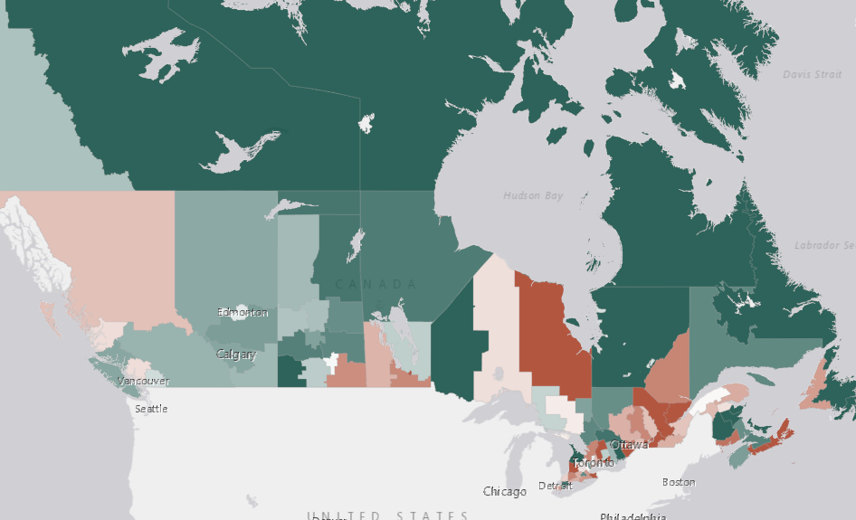

## ANALYZING DATA

In ArcGIS Online, you can add data from the Living Atlas, curated by Esri, from web services produced by other agencies, or you can add your own data in [multiple data formats](https://storymaps.arcgis.com/stories/c9d52ddee8f040d0acb4d219598f7fb6).

In this section, we want to continue exploring COVID-19 data, and deaths due to COVID-19, in Canada. We saw that the John Hopkins data only has provincial-level data for Canada, so let's see if we can find data with more detail.

It turns out there are some other data available about COVID-19 in Canada. Some provide data for download, and some sites provide visualizations or maps with the data available. Below is a list of just some of the COVID-19 data resources.

[Esri COVID-19 Open Data](https://resources-covid19canada.hub.arcgis.com/pages/open-data)

[University of Toronto Libraries COVID-19 Data Resources](https://mdl.library.utoronto.ca/covid-19/resources)

[Flatten](https://www.flatten.ca/)

[COVID-19 in Canada](https://art-bd.shinyapps.io/covid19canada/)

[COVID-19 Canada Open Data Working Group](https://opencovid.ca/)

[Canada COVID-19 interactive growth rate explorer](https://mountainmath.ca/shiny/canada_covid-19/?_inputs_&level=%22province%22&metric=%22Confirmed%22&province=%2201%22&start_cutoff=100)

Because we're working in ArcGIS Online, let's take a look at a comprehensive [dataset](https://resources-covid19canada.hub.arcgis.com/datasets/health-region-summaries) that provides health region summaries from Esri's data hub for COVID-19 data in Canada.

The map associated with this dataset at the link above shows the extent of the data and the divisions of health region summaries. Clicking on **View Table** in the upper right will open the attribute table and shows us all of the attributes associated with this dataset. Notice the population data by age available for this dataset. Use the bar at the bottom of the table to scroll to the right.

Age-related data will be useful for trying to visualize the relationship between death due to COVID-19 and age since we know that [vulnerability increases with age, particularly over 60 years](https://www.canada.ca/en/public-health/services/publications/diseases-conditions/vulnerable-populations-covid-19.html).

[StatCan found that 52% of excess deaths in Canada from March to June 2020](https://www.ctvnews.ca/health/coronavirus/canadians-age-85-and-older-account-for-over-half-of-excess-deaths-amid-covid-19-statcan-1.5205790), assumed to be due to COVID-19, were among those 85 and older, which is a specific age category in this dataset.

Note the download icon on the left side of the map interface. If we click on this, a list of download options will appear on the left. We see that this dataset is available in a number of different formats. To use this data in ArcGIS Online, we could download the data as a spreadsheet or a shapefile, but there are several reasons to use the data in ArcGIS Online without ever downloading it, which may require using a desktop GIS application to manipulate the data before adding it back to ArcGIS Online.

Good reasons to use data available online through Esri include:
- Popups that have already been configured appropriately.
- Ability to create new fields and manipulate data using [Arcade](https://www.esri.com/arcgis-blog/products/apps/uncategorized/introducing-arcade/) expressions.
- Curated data that would be difficult to find otherwise, like the Health Region Summaries.

We'll add this dataset as a [web service](https://doc.arcgis.com/en/arcgis-online/reference/arcgis-server-services.htm) hosted by Esri in ArcGIS Online to our map.

*1*{: .circle .circle-blue} From the map you created in your ArcGIS Online account, click the **Add** button and select **Web service**.  

*2*{: .circle .circle-blue} Copy and paste the following URL in the box and click **Add to map** and then the **x** to close the dialog window.

```json
    https://services9.arcgis.com/pJENMVYPQqZZe20v/arcgis/rest/services/NewHybridRegionalHeathBoundaries/FeatureServer
```

This layer may have a visibility range associated with it that requires you to zoom in to see it. You can guess this might be the case if no new symbols show up in the map and/or if the name of the layer appears greyed out.

*3*{: .circle .circle-blue} Click the Layers button.

If the properties for the new layer don't appear on the far right, click on the ellipsis on the right for this new layer and select **Show properties**.

*4*{: .circle .circle-blue} Scroll down until you see **Visible range** and drag the slider all the way to the left. Save your map.

Let's try and understand the severity of COVID-19 in Canada using this data.

[Two measures used to assess severity of an infectious disease](https://www.who.int/news-room/commentaries/detail/estimating-mortality-from-covid-19) are the infection fatality ratio (IFR) and the case fatality ratio (CFR). We only have data to calculate the CFR.

*5*{: .circle .circle-blue} Rename the layer to **Case Fatality Ratio (%)**.

*6*{: .circle .circle-blue} Click on **Edit layer style** under the **Symbology** properties to the right of the map.

The case fatality ratio (CFR) helps us understand how many people with a confirmed diagnosis of COVID-19 die as a result. Because it is not equal to the number of people who actually have COVID-19, [it is difficult to measure accurately](https://newslit.org/updates/case-fatality-rate-vs-mortality-rate/). Recognizing these limitations, we will use it as an indicator of which health regions in Canada have lower or higher case fatality rates.

The [formula](https://www.britannica.com/science/case-fatality-rate) for CFR takes the number of deaths divided by the number of cases and multiplies it by 100.

*7*{: .circle .circle-blue} Click the **x** next to **Cases Per 100K Population** and then **Expression**. This will open a new window where you can use the Arcade language to build expressions.

*8*{: .circle .circle-blue} Copy and paste the following expression in the window.

```json
    ($feature.Deaths / $feature.CaseCount * 100)
```

*9*{: .circle .circle-blue} Click the **Edit** icon near the word **Custom** and rename this new field to **Case Fatality Ratio**. Click **Save** and then **OK**.

The symbology defaults to proportional symbols, but these overwhelm certain areas of the map. One option might be to resize these symbols, but we are going to experiment with [choropleth](http://wiki.gis.com/wiki/index.php/Choropleth_map) symbology, in which areas are shaded or patterned proportionally to the value of a variable measured for each area, to show the Case Fatality Ratio.

In choropleth mapping:
- The variable is usually quantitative.
- A colour is associated with an attribute value.
- Shading illustrates how a measurement varies across a geographic area.

You can read more about and see examples of choropleth [maps](https://arcg.is/15Xffe).

*10*{: .circle .circle-blue} Click on **Counts and Amounts (color)** to open the **Style options**, and you'll notice a dark cluster of health regions in eastern Canada.

The default symbology uses **High to Low** which represents a range of percentages from low to high. In the [histogram](https://en.wikipedia.org/wiki/Histogram), the *x* represents the average CFR across all health regions.

*11*{: .circle .circle-blue} Select the **Above and Below** theme from the dropdown menu and notice how the algorithm selects breaks in the data that are more in line with what the histogram is telling us about the how the data is grouped.

*12*{: .circle .circle-blue} Under **Symbol style**, click the pencil icon to open a new window to select a different color ramp and choose the second one and then click **Done**.

This color ramp using the **Above and below** theme is telling us that green health regions on the map have lower than normal CFR rates and the darker red health regions have higher than normal CFR rates, while regions coloured in white reflect the average.

Do you think High and Low or Above and Below is a better representation of this data?

To learn more about these different themes and also about whether to classify data or not, check out this Esri blog post [Better Breaks Define Your Map’s Purpose](https://www.esri.com/arcgis-blog/products/arcgis-online/mapping/better-breaks-define-your-maps-purpose/).

Let's now experiment with classifying the data.

*13*{: .circle .circle-blue} Click on **Style options** again and toggle the **Classify Data** on, which will change the symbology, defaulting to the [Natural Breaks](http://wiki.gis.com/wiki/index.php/Jenks_Natural_Breaks_Classification) classification method which attempts to mathematically find "natural" classes that group together in a dataset. It also defaults to four classes.

Notice the range of values represented in each class.

*14*{: .circle .circle-blue} Now select the [Quantile](http://wiki.gis.com/wiki/index.php/Quantile) classification method from the dropdown under **Method**, which creates classes with the same number of features. Notice the range of values using this classification, too.

Classification is useful when we are asking specific questions of the data. In this case, what meaning does each class have for understanding the CFR across Canada? Is the data easier to understand classified or unclassified?

Classification may be more useful comparing CFRs across countries, for example, but differentiating between a region with 1.58% and a region with 2.58% CFR is not inherently meaningful.

Using the Above and Below option reveals which regions are above or below the average CFR across all regions.

*15*{: .circle .circle-blue} Toggle the **Classify** button off and choose the  **Above and Below** theme, then click **Done** twice. Save your map.

Let's configure the popups to include the CFR.

*16*{: .circle .circle-blue} Select the **Configure Popup** icon on the far right (5th one down) and click on **Manage Expressions** and then **Add expression**.

*17*{: .circle .circle-blue} Edit the name to be **Case Fatality Ratio (%)**.

*18*{: .circle .circle-blue} Copy and paste the following expression in the expression window and then click **OK**

```json
    ($feature.Deaths / $feature.CaseCount * 100)
```
*19*{: .circle .circle-blue} Next click on **Fields list** and then **Select fields**. Click the new **Case Fatatlity Ratio (%)** field you just created and then **Done**.

Now when you click on the popup, the CFR will appear at the bottom.

Your map should look something like the image below, but keep in mind the data is constantly changing, so it won't look exactly the same.



It's important to keep in mind that the majority of Canada's population lives clustered along the southern belt of Canada, closer to the U.S. border. So a map like this does not do a good job of representing smaller populations in more northern regions of the country. These health regions summaries are better at representing what's happening in more populated areas.

In the next section, we'll add some population data to help contextualize the CFR in these locations.
