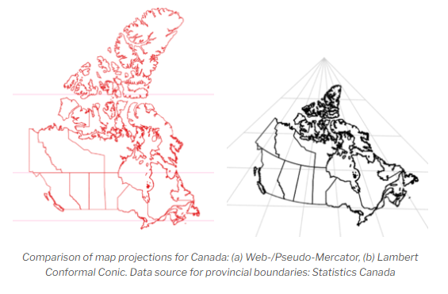

## CHANGE THE BASEMAP

All basemaps in the basemap gallery in ArcGIS Online are in the [Web Mercator](https://en.wikipedia.org/wiki/Web_Mercator_projection) projection, which distorts size the closer you get to the North Pole. Take a look at your map again and notice how disproportionately large the Northern Territories are in the Light Gray Canvas basemap.

Because we are now going to focus on Canada, let's use something that is more appropriate for this regino of the world. A far better projection for Canada is the Lambert Conformal Conic, which you can see side-by-side in the image below with the Web Mercator projection.

<figure>
  
  <figcaption><a href="https://gis.blog.ryerson.ca/2020/11/03/how-to-lie-with-covid-19-maps/">The Web Mercator projection is often used for web mapping.</a> (c) <a href="https://gis.blog.ryerson.ca/about-the-author/">Claus Rinner,</a> <a href="https://creativecommons.org/licenses/by-nc/3.0/">CC BY-NC 3.0</a>.</figcaption>
</figure>

&nbsp;

 Let's try and find a basemap with the Lambert Conformal Conic projection by searching ArcGIS Online, since all of the basemaps in the gallery are Web Mercator.

To Do
{: .label .label-green }
From the left sidebar, click on **Add** and click on **Browse layers**.

*1*{: .circle .circle-blue} Select **ArcGIS Online** from the dropdown and then search for **Canada_Provincial_Boundaries_3347**. Add this to the map as the basemap by clicking on the layer and then **Use as basemap**.

Now any data we add to the map will reproject on the fly to this Lambert Conformal Conic projection, although you may notice that the reprojection of the data we added is not perfect.

Be sure and save your map.

***

For more information about map projections, check out another Research Commons workshop [Understanding Spatial Data: Map Projections](https://ubc-library-rc.github.io/map-projections/).
