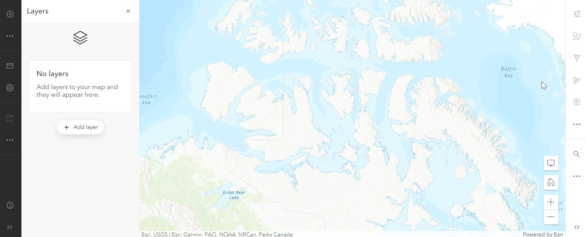
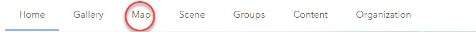

## CREATE A WEB MAP
A web map, simply put, is an interactive map. Esri's online platform, called ArcGIS Online, provides an easy way to create a web map. If you haven't done so already, sign into the ArcGIS Online (AGOL) public account you created before.

To Do
{: .label .label-green }
From the ribbon at the top of the page, click on the Map tab. 

This will open a new map. If in the upper right it says **Open in new Map Viewer**, click on these words to go to the new map template.

You will see that the map is pre-populated with a topographic basemap and that it comes with built in functionality. Let’s explore some of the things you can do with the map without any modifications.

*1*{: .circle .circle-blue} In the lower right of the map are several interactive icons. The + and – symbols allow you to zoom in and out, and you can click and drag with your mouse to move the map around.

*2*{: .circle .circle-blue} If you want to zoom in to a particular location, hold down the Shift key and then drag your mouse around the area you are interested in.

*3*{: .circle .circle-blue} The house icon in the lower right returns the screen to the same extent as it was when you opened it. If you zoom in to a different area and save this map, the next time you open it, it will open at the extent that it was when you saved it.

On the right sidebar are search, measure, directions, and location icons. The other icons may be greyed out until you add data to the map and may also be enabled depending on whether or not you have a public or paid account.

*4*{: .circle .circle-blue} The left sidebar contains multiple tools with which to interact with data in the map. We'll explore these more later. You can expand both sidebars by clicking the double arrow at the bottom.

Next we’ll try adding data to the map using different methods.
