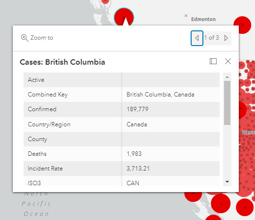
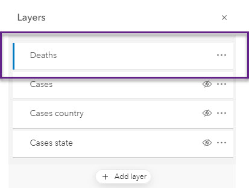

##  EXPLORE DATA LAYERS

To Do
{: .label .label-green }
Click on the red circle located in British Columbia to view a pop-up containing information about the number of confirmed, recovered, deaths, and active cases of COVID-19.

You'll notice that there are three entries for British Columbia with the same information.

In the **Layers** pane, there are four layers associated with the data we added from the Living Atlas.

*1*{: .circle .circle-blue} Hover over each layer next to the ellipsis on the right and click the eye symbol to hide every layer except the one representing **Deaths**. You'll see that this layer is depicted using the symbol of a black X.

*2*{: .circle .circle-blue} Click on the **Deaths** layer, and you'll notice the properties of this layer appear in another pane on the right side of the map. From this pane, you could also select another layer from the dropdown arrow at the top to view its properties.

*3*{: .circle .circle-blue} From the **Layers** pane, click the ellipsis (the three horizontal dots) next to the **Deaths** layer to expand the options available.

*4*{: .circle .circle-blue} Click on **Show table** to open the attribute table for this layer.. The table, which contains the underlying data in spreadsheet form, will open at the bottom of your screen. You can click on the up arrow at the top right of the table to see more rows at one time. Note that you can also click on individual symbols in the map to open a pop-up with the same attributes as exist in the table.

 In Map Viewer Classic, you can use the attribute table to interact with and filter the data. In the new Map Viewer, which we are using, we'll use a separate tool called **Filter**.

*5*{: .circle .circle-blue} Click on the third icon down in the far right pane to open the **Filter** widget.

Let's filter the data in order to find those places in the world that have surpassed 10,000 deaths from COVID-19.

*6*{: .circle .circle-blue} From the dropdown arrow on the right of the first field in the **Filter** pane, select the **Deaths** field and then click on **Replace**.

From the dropdown arrow in the centre, select **is greater than**.

In the next field, type in **10000**.

Then click **Save**.

The **Filter** pane will close, and the data in the map will reflect the parameters of the filter.

You may notice that the black X symbolizing the **Deaths** layer is very hard to see. In the next section, we will change the symbology of this layer to make it more visible. Save your map first.
