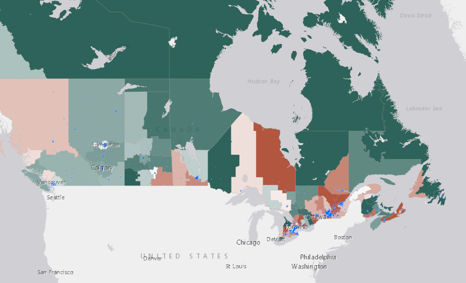

## ADD POPULATION DATA

Just as we did in the first exercise, we can search for layers in ArcGIS Online that make our map more meaningful.

Census data from [Statistics Canada](https://open.canada.ca/data/en/dataset/3cf36302-1060-444e-988a-d97b6db5ad240) is normally a great place to find population information, but it's also usually distributed by area, whether Census subdivisions or dissemination areas. Two layers of polygons stacked on top of one another are difficult to view.

[Agriculture and Agri-Food Canada](https://www.agr.gc.ca/eng/agriculture-and-agri-food-canada/?id=1395690825741) has a robust [ArcGIS Online presence](http://bit.ly/16o91lM), and they also happen to publish population data in a way more useful for our purposes. They host an ArcGIS Online layer of the [Canadian Ecumene Database](https://open.canada.ca/data/en/dataset/3f599fcb-8d77-4dbb-8b1e-d3f27f932a4b), a database produced by Natural Resources Canada and representing populated places. Ecumene is a word meaning "inhabited lands."

Let's see if we can find and add this dataset to our web map.

To Do
{: .label .label-green }
From your web map, click the **Add** dropdown arrow and select **Search for Layers**. From the dropdown arrow, make sure **ArcGIS Online** is selected.

*1*{: .circle .circle-blue} In the search box, type **canada population ecumene** and click the heading for the **Populated Places - Canadian Ecumene** layer to read about the dataset before clicking on **Add to Map**. Click the back arrow to see the contents in your map again.

**Populated Places** is produced by Esri Canada using data from The Canadian Ecumene GIS Database, which includes the custom boundaries for more than 4,200 populated areas across Canada. You can read more about the database [here](https://open.canada.ca/data/en/dataset/3f599fcb-8d77-4dbb-8b1e-d3f27f932a4b).

*2*{: .circle .circle-blue} If it's not already at the top in your Table of Contents, hover over the left side of the layer with your cursor and then click on the three vertical dots to move it to the top. Make sure it is checked on.

You'll notice that the default symobology for the **Populated Places** layer is red, which is a colour I recommend using sparingly and with intention in maps. In this case, it's also hard to see.

*3*{: .circle .circle-blue} Open the symbology (Change Style) for this layer and click on **OPTIONS** under **Select a drawing style** and then on the word **Symbols**.

*4*{: .circle .circle-blue} In the editable box that has a number with a # symbol in front of it, copy and paste #0070FF and click **OK**, then **OK** again, then **DONE**, then save your map.

The blue colour is more neutral and also provides decent contrast with the symbology from our CFR layer. Your map should look something like this:

This population data provides a helpful visualization of how population is distributed across Canada, and we can see that generally speaking, areas with greater population densities have a higher case fatality ratio.

In the next section, we'll compare two variables using what's called a [bivariate choropleth map](https://www.joshuastevens.net/cartography/make-a-bivariate-choropleth-map/).
