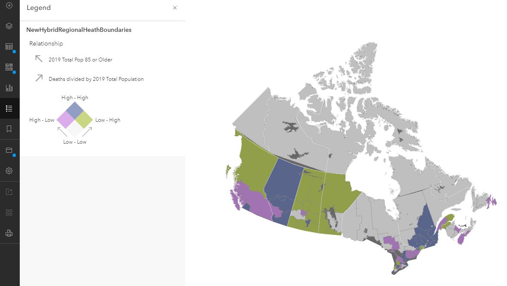

## RELATING DATA

One of the strengths of the **Health Region Summaries** data is the age-related information that comes with it. While it does not tell us COVID-19 deaths by age, we can create a map that shows the relationship between two variables, deaths and the population 85 years and older.

You may remember that we created a copy of this dataset in our web map. If you haven't done so already, we'll start off by renaming it.

To Do
{: .label .label-green }
Add the **Health Region Summaries** data again to the map to have a copy of the layer by adding a web service and pasting the URL below.

```json
    https://services9.arcgis.com/pJENMVYPQqZZe20v/arcgis/rest/services/NewHybridRegionalHeathBoundaries/FeatureServer
```

*1*{: .circle .circle-blue} Change the visibility of the newly added layer, uncheck all other layers, and rename it to **Deaths Per Pop & Pop 85 +**. Save your map.

Let's play around with the symbology to see how we can best show the relationship between deaths and the most vulnerable age group to COVID-19, those 85 years and older.

*2*{: .circle .circle-blue} Open the properties of this **Health Region Summaries** copy by clicking the ellipsis and selecting **Show properties**.

*3*{: .circle .circle-blue} Click on **Edit layer style** and then on **Field**. Click on both **Deaths** and **2019 Total Pop 85 or Older** and then **Add**. Click the x next to **Cases per 100K** to get rid of it.

We see that once we select two attributes instead of one to display, different drawing styles become available. The default is the proportional symbology we previously used to show deaths from COVID-19 around the world.

*4*{: .circle .circle-blue} Scroll down until you see the **Relationship** option and click this once to see what happens to the symbology in the map.

What is referred to in ArcGIS Online as a Relationship symbology really refers to a [bivariate choropleth map](https://www.joshuastevens.net/cartography/make-a-bivariate-choropleth-map/), which helps us understand the relationship between two variables. Since we know there is a relationship between deaths due to COVID-19 and age, this seems like an appropriate symbology to use.

For more information on the Relationship mapping style, check out this [How to Smart Map: Relationships](https://www.arcgis.com/apps/Cascade/index.html?appid=28f71c557007440ebd936b21969ffff8) story map.

*5*{: .circle .circle-blue} Click the **Style options** button on the Relationship drawing style again to open the symbology properties.

We are presented with menus for Symbol style, Grid size, Method, and Focus, respectively.

*6*{: .circle .circle-blue} Ignoring that for now, first expand the **Deaths** layer below the **Method** dropdown menu.

We want to turn the deaths into a ratio of number of deaths divided by total population instead of using deaths as an absolute number because it's a better way to compare populations across different health regions.

*7*{: .circle .circle-blue} To do this, select **2019 Total Population** under the **Divided By** dropdown menu and then **Add**.

Leave the **Focus** as **High values** because we're interested in where high death rates per total population overlap with a higher population 85 years and older.

*8*{: .circle .circle-blue} Change the **Grid size** to **2x2** which shows above and below average rather than spreading the data values over low, middle, and high categories.

By default, the map uses the **Quantile** classification method to spread the data over enough categories to illustrate differences. Let's play around with a couple different classification methods.

*9*{: .circle .circle-blue} Take a look at both the **Natural Breaks** and **Quantile** classification methods and notice what different maps these two methods produce. Natural Breaks classifies the data according to natural breaks in the data.

We'll use the default Quantile classification method. The risk in doing this is the implication of more heterogeneity in the data than actually exists, but it is telling us the same story that we've seen in the other maps we've produced, where higher rates of death relate to higher population of 85 and older where the population density is highest.

*10*{: .circle .circle-blue} Ensure **Quantile** is selected.

*11*{: .circle .circle-blue} Click on the pencil icon under **Symbol style** and select the fourth option and then **Done** twice. Save your map.

Your map should look something like the below image.



In the next section, we'll create a [story map](https://storymaps.arcgis.com/stories) in order to tell a visually rich story of COVID-19 deaths in Canada.

***

For additional examples of bivariate choropleth maps, see how Metro Vancouver is using a variety of indicators derived from Census data to explore equity and marginalization as part of their [Social Equity and Regional Growth Study Final Report](http://www.metrovancouver.org/boards/RegionalPlanning/RPL_2021-Mar-5_AGE.pdf#page=20). See [maps 50-57](http://www.metrovancouver.org/services/regional-planning/PlanningPublications/Equity_Regional_Growth_Management_Study_Phase2-Appendix-I-Maps.pdf) for bivariate choropleth maps and the preceding slides for examples of choropleth maps using only one variable.
