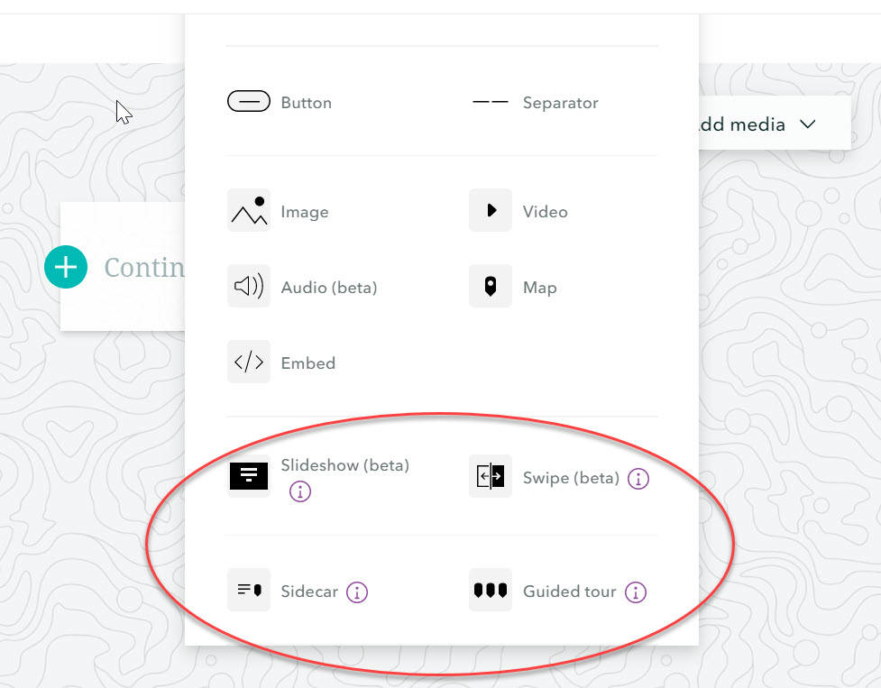

## CREATE A STORY MAP

Some of you have probably already seen examples of [Story Maps](https://www.esri.com/en-us/arcgis/products/arcgis-storymaps/stories).

Anyone with an ArcGIS Online account can create one, and they are a good way to tell a story with maps, pictures, videos, and text.

They can be used as a presentation tool in place of PowerPoint, especially if you want to incorporate maps or embedded interactive content.

### Examples of Story Maps

- [Chloropleth Map](https://arcg.is/15Xffe)
  - This uses a Map Journal template and is actually a story map all about chloropleth maps
- [The Assassination of Abraham Lincoln](https://arcg.is/1LSaGu)
  - This uses a Map Tour template
- [Devastation in Nepal: Kathmandu Before and After the April 2015 Earthquake](https://arcg.is/1zvCaX)
  - This story map uses Map Series and Swipe story map templates
- [The GIS community responds to the COVID-19 crisis](https://arcg.is/1qfqiD)
  - This represents the latest template that we will use today which resembles a scrolling website

In this section, we'll add the web maps we created to a Story Map and practice adding other content as well.

First uncheck all the layers except **Coronavirus COVID-19 Cases V2 - Deaths Proportional** in your map and save it.

There are a couple different ways to create a Story Map.

To start from scratch, go to [Story Maps](https://storymaps.arcgis.com/) and click on **New Story.**

For this workshop, we'll use a different method.

To Do
{: .label .label-green }
From the top left of your web map, click on the **Home** dropdown arrow and select **Content.**

*1*{: .circle .circle-blue} Click on the web map you created and just exited.

This will take you to the **Overview** page.

*2*{: .circle .circle-blue} On the far right, from the **Create Web App** dropdown, select **StoryMaps.**

This will take you to a template with your web map already embedded.

*3*{: .circle .circle-blue} Add a title and subtitle. You can copy and paste the text below to use.

**Title**: Mapping Coronavirus Deaths

**Subtitle**: Visualizing COVID-19 Deaths in ArcGIS Online

Scrolling down, you'll see your interactive web map. The popups will work as you configured them.

Let's add some context before the web map.

*4*{: .circle .circle-blue} Above the web map, click on the + sign to see the options.

*5*{: .circle .circle-blue} Choose to add an **Image**, use the **Link** option and past the following URL: https://ginsberg.umich.edu/files/gb/field/image/covid-19_C.jpg

*6*{: .circle .circle-blue} Next choose to add a **Heading** by click the + sign below the image you just added.

You might ask a question in the heading, such as **A Brief History of COVID-19**

*7*{: .circle .circle-blue} Add text above the map by clicking on the plus sign and selecting **Text**.
Copy and paste the text in the paragraphs below. Note that the numbers will have changed by the time you are doing this exercise.

*The SARS-CoV-2 virus, more commonly known as COVID-19, originated in Wuhan, China in December 2019. Fourteen months later, there are a documented 109,887,743 cases around the world and 2,429,689 deaths. More than 61,867,144 people have recovered*

*The most recent COVID-19 statistics are tracked in an Esri Dashboard hosted by John Hopkins University.*

*Below are a series of web maps representing COVID-19 deaths in different ways, beginning with a global view and then narrowing in on health regions across the country of Canada.*

*8*{: .circle .circle-blue} Add a link to the word Dashboard with this URL: https://coronavirus.jhu.edu/map.html

*9*{: .circle .circle-blue} Scroll beneath the embedded web map and add the following caption: COVID-19 Deaths Greater Than 10,000

*10*{: .circle .circle-blue} Click the + sign below and select **Map** and then add the same web map we created in this workshop. Hover over the top middle of the map and click on the pencil icon to edit it. In edit mode, click the **Settings** wheel to turn the **Legend** and then **Place map** in the lower right.

This will open up a window to allow you to choose which layers to show in this map.

*11*{: .circle .circle-blue} Make sure all layers are off except **Case Fatality Ratio (%)** and **Populated Places**. Click the **Settings** wheel to turn the **Legend** on for this map and place it.

*12*{: .circle .circle-blue} Recaption this map as **Case Fatality Ratio (%)**

*13*{: .circle .circle-blue} Click the + sign below again and add the web map, this time with only the **Deaths Per Pop & Pop 85 +** layer turned on. Turn the legend on for this map, too.

*14*{: .circle .circle-blue} Recaption this map as **Relationship between deaths per total population and population 85 years and older**.

If you have more time, you can experiment with adding more content to your story map.

For example, you can do a Google Image search to find images to add.

You can change the style of your Story Map in a certain section by choosing to add a different template.

You can also change some aspects of the design of your Story Map by clicking the **Design** button at the top right of the page.

*15*{: .circle .circle-blue} When you're done configuring your Story Map, click on **Preview** to see what it will look like outside of edit mode.

*16*{: .circle .circle-blue} By clicking **Publish**, you can choose to share your Story Map with your organization if your Esri account is linked to one or with the public.

Your story map should end up looking something like this [one](https://arcg.is/mKjuy).

Esri recently started promoting this style of the Story Map we have been experimenting with here.

Their older styles, called Classic Story Maps, offer different functionality and in some cases, more map-centric Story Maps.

If you are interested in checking out other possibilities, you can tour the Classic Story Map [gallery](https://storymaps-classic.arcgis.com/en/gallery/#s=0&md=storymaps-apps:map-tour).
