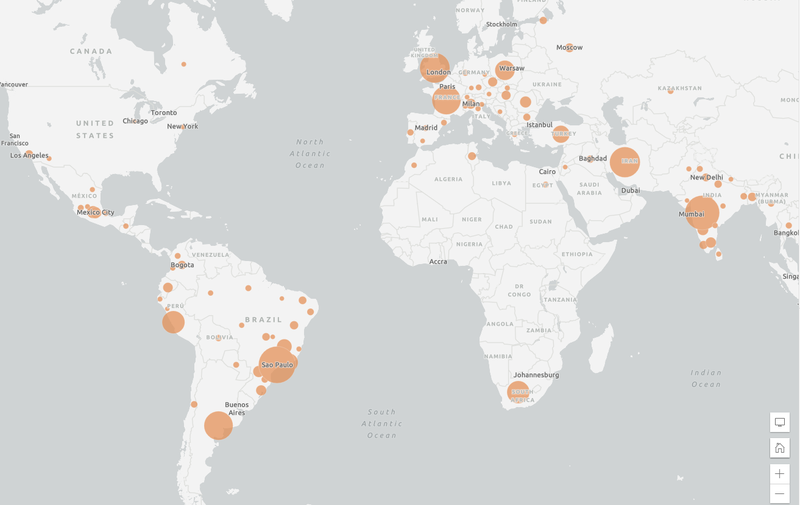

## SYMBOLOGY

To Do
{: .label .label-green }
Click on the ellipsis next to the **Deaths** layer under **Layers** and select **Show properties**.

*1*{: .circle .circle-blue} In the **Properties** pane on the right, click on **Edit layer style** under **Symbology**.
The **Styles** pane will open.

*2*{: .circle .circle-blue} Click on the **Current style**, which should be **Location (single symbol)**.

*3*{: .circle .circle-blue} Click on the pencil icon under the **Symbol style** field that appears to change the symbology.

Under **Basic shapes**, select the circle.

Change the size to **12 points** and select black for the colour.

If there is any transparency for the symbol by default, ensure this is set to 0.

*4*{: .circle .circle-blue} Click **Done**, then **Done** again and make sure to save your map.

The distribution of deaths across the world is now much more visible.

But because the data is represented differently depending on the country, the symbology does not accurately represent the number of deaths per country. As mentioned before, some countries have death counts by city, some by county, and some only at the country level.

Let's experiment with another kind of symbology. Using the Map Viewer Classic, it was much easier to create copies of layers. Some of the functionality from Map Viewer Classic is still not available in the new Map Viewer, which has certain elements not available in the Classic Viewer.

Instead of creating a duplicate layer to symbolize differently, we'll re-add the same layer from the Living Atlas in the same way we did before.

*5*{: .circle .circle-blue} First get rid of the three layers we're not using by clicking the ellipsis next to each and selecting **Remove**.

*6*{: .circle .circle-blue} Then click **Add layer** and use the Living Atlas to add the same **Coronavirus COVID-19 Cases V2** layer.

Remove all the layers except the new **Deaths** layer and save your map.

*7*{: .circle .circle-blue} Click the ellipsis next to the new **Deaths** layer and select **Rename**. Change it to **Deaths (proportional)**.

Then select **Show properties**.

*8*{: .circle .circle-blue} Click **Edit layer style**.

For some reason, there is no field currently associated with this layer, so we need to add one.

*9*{: .circle .circle-blue} Click **Field** and select **Deaths** from the list that appears. Click **Add**.

This will prompt the appearance of different symbology options.

By default **Counts and Amounts (Size)** is the current style.

These are also called [proportional symbols](https://pro.arcgis.com/en/pro-app/help/mapping/layer-properties/proportional-symbology.htm), which you can read more about [here](https://www.axismaps.com/guide/proportional-symbols).

Qualities of proportional symbols:
- Maps using these are a kind of thematic map used to show relative differences in quantities.
- The size of simple symbols is scaled proportionally to the data value at that location.
- The larger the symbol, the greater the data value at that location.

You can make adjustments to this symbology, but we'll accept the defaults for now.

Click **Done**.

*10*{: .circle .circle-blue} Add the same filter we did to the original layer to make the symbology more meaningful, where the expression is Deaths greater than 10,000.

[Proportional](http://wiki.gis.com/wiki/index.php/Proportional_symbol_map) symbology is a good way to be able to immediately visually locate the areas with the greatest numbers of COVID-19-related deaths.

Be aware that it is easy to misrepresent data based on the symbology you choose to use. It is worth doing some research to help you decide what symbology choice makes the most sense.

[ArcGIS Online Change Style Quick Reference](https://doc.arcgis.com/en/arcgis-online/create-maps/change-style.htm)

*11*{: .circle .circle-blue} Save your map.

Your map should end up looking something like this.

In the next section we'll add additional data from ArcGIS Online and customize the symbology and popups to analyze the data in different ways.
