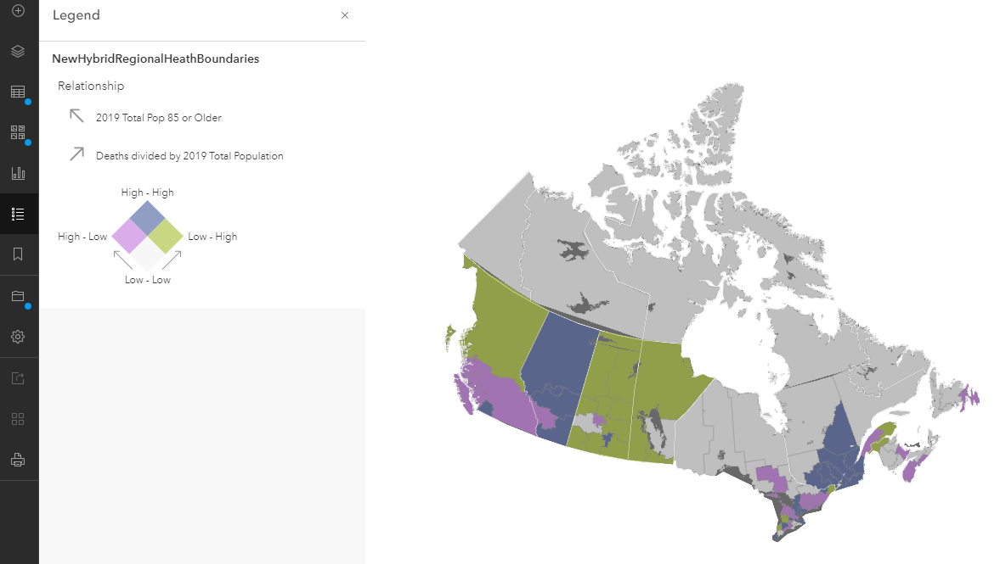

# Visualizing Data in ArcGIS Online

## OUTLINE

### **Goals**
This workshop introduces complete beginners to the [ArcGIS Online](https://www.arcgis.com/home/index.html) platform and tools. This workshop is intended for those unfamiliar with GIS software or code but who want to be able to create a map, add their own data, and configure a Story Map. By the end of this workshop participants will be able to:

  - Discover and explore available geospatial data online
  - Add data to a map
  - Symbolize data
  - Configure pop-ups
  - Embed a map in a Story Map
  - Add photos and text to a Story Map

  *Please be aware that this workshop uses data about deaths due to COVID-19 to explore these learning objectives, a subject which might be difficult for some people.

### **Workshop Outline**

- Create three web maps using ArcGIS Online
- Add data from the [Living Atlas](https://livingatlas.arcgis.com/en/home/) and explore this dataset
- Add data from ArcGIS Online and customize using different symbology
- Create a story map using your web maps

#### One of the web maps we will build

### **Setup**
You will need to sign up for a free ArcGIS public [account](https://www.arcgis.com/home/signin.html) ahead of time. If you already have an account with Esri, you can choose to use your regular sign in or create a separate free account.

Click **Create an account**.

Under Create a free public account, click **Create an ArcGIS Public Account** and follow the instructions.

**Geospatial Information Resources at UBC:**

  - General Informational website for all things UBC GIS: [gis.ubc.ca](https://gis.ubc.ca)
  - UBC Library's guide for finding and working with GIS resources: [guides.library.ubc.ca/gis](https://guides.library.ubc.ca/gis)
  - UBC's GIS email list: [UBC GIS ListServ](https://lists.ubc.ca/scripts/wa.exe?SUBED1=GIS-LIST&A=1)
  - UBC's GIS Slack (create your own channel or lurk!): [ubcgis.slack.com](https://ubcgis.slack.com)
  - Sign up for a [GIS consultation](https://researchcommons.library.ubc.ca/consultation-requests/) at the Research Commons
  - UBC Library GIS Help email: library.gis AT ubc.ca
